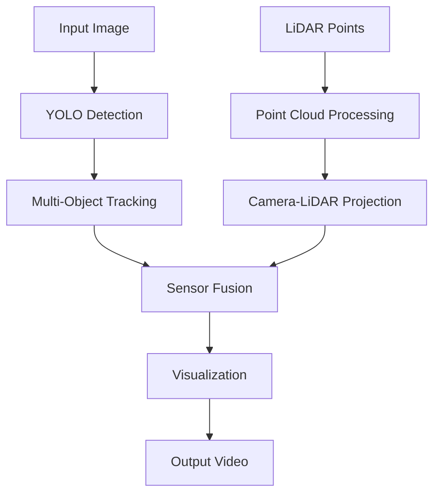

# KITTI Perception Pipeline

A comprehensive multi-modal perception system for autonomous driving using the KITTI dataset. This project implements object detection, multi-object tracking, and sensor fusion between camera and LiDAR data.

## Features

- **Object Detection**: YOLOv8-based detection for cars and pedestrians
- **Multi-Object Tracking**: Custom tracking algorithm with ID assignment
- **Sensor Fusion**: Camera-LiDAR fusion for distance estimation
- **Real-time Processing**: Optimized pipeline with performance monitoring
- **Visualization**: Rich visualization with bounding boxes, IDs, and distance information

## 📁 Project Structure

```
Assignment_sujal/
├── detector/
│   ├── __init__.py
│   └── yolo_detector.py          # YOLOv8 object detection
├── tracker/
│   ├── __init__.py
│   └── deep_sort_tracker.py      # Multi-object tracking
├── fusion/
│   ├── __init__.py
│   └── sensor_fusion.py          # Camera-LiDAR fusion
├── utils/
│   ├── __init__.py
│   ├── lidar_utils.py           # LiDAR processing utilities
│   └── visualization.py         # Visualization tools
├── dataset/                     # KITTI dataset (not included)
│   ├── data_tracking_image_2/
│   ├── data_tracking_calib/
│   └── data_tracking_velodyne/
├── main.py                      # Main pipeline
├── requirements.txt             # Dependencies
├── yolov8n.pt                  # YOLOv8 model weights
└── README.md                   # This file
```

##  Pipeline Flow



### Processing Steps:

1. **Image Loading**: Load RGB images from KITTI dataset
2. **Object Detection**: Detect cars and pedestrians using YOLOv8
3. **Tracking**: Assign unique IDs and track objects across frames
4. **LiDAR Processing**: Load and filter point cloud data
5. **Projection**: Project 3D LiDAR points to 2D image plane
6. **Fusion**: Associate LiDAR points with detected objects for distance estimation
7. **Visualization**: Render results with bounding boxes, IDs, and distances
8. **Output**: Generate processed video with all annotations


## Usage

### Basic Usage
```bash
python main.py
```

### Custom Dataset Path
```python
from main import PerceptionPipeline

# Initialize pipeline
pipeline = PerceptionPipeline("path/to/your/dataset")

# Run processing
pipeline.run_pipeline("output_video.mp4")
```

### Processing Single Frame
```python
# Process individual frame
vis_image, objects = pipeline.process_frame(
    image_path="path/to/image.png",
    velodyne_path="path/to/pointcloud.bin"  # Optional
)
```


##  Configuration

### Detector Settings
```python
# In detector/yolo_detector.py
target_classes = ['car', 'person']  # Classes to detect
confidence_threshold = 0.5          # Detection confidence
```

### Tracker Settings
```python
# In tracker/deep_sort_tracker.py
max_disappeared = 10               # Frames before track deletion
max_distance = 100                 # Maximum association distance
```

### Fusion Settings
```python
# In fusion/sensor_fusion.py
image_width = 1242                 # KITTI image width
image_height = 375                 # KITTI image height
```

## 📈Output

The pipeline generates:
- **Video Output**: Annotated video with bounding boxes, track IDs, and distances
- **Performance Metrics**: FPS, processing time, object counts
- **Console Logs**: Real-time processing status

### Sample Output Information:
```
Frame 100/154, FPS: 18.45, Objects: 3
Pipeline completed!
Average FPS: 17.23
Total processing time: 8.94s
Output saved to: kitti_perception_output.mp4
```

##  Key Components

### 1. Object Detection (`detector/yolo_detector.py`)
- Uses YOLOv8n for real-time detection
- Filters for cars and pedestrians only
- Returns bounding boxes with confidence scores

### 2. Multi-Object Tracking (`tracker/deep_sort_tracker.py`)
- Simple centroid-based tracking algorithm
- Maintains object IDs across frames
- Handles object appearance/disappearance

### 3. Sensor Fusion (`fusion/sensor_fusion.py`)
- Projects LiDAR points to camera coordinates
- Associates 3D points with 2D detections
- Estimates object distances using point clouds

### 4. Visualization (`utils/visualization.py`)
- Renders bounding boxes with track IDs
- Displays distance information when available
- Color-coded visualization for different object types

## 🔍 Technical Details

### Coordinate Transformations
The pipeline handles multiple coordinate systems:
- **LiDAR coordinates**: 3D Velodyne coordinate system
- **Camera coordinates**: 3D camera coordinate system  
- **Image coordinates**: 2D pixel coordinates

### Calibration
Uses KITTI calibration matrices:
- `P2`: Camera projection matrix
- `Tr_velo_to_cam`: LiDAR to camera transformation
- `R0_rect`: Rectification matrix

## 🚧 Limitations

- **Dataset Dependency**: Requires KITTI dataset structure
- **Simple Tracking**: Basic centroid tracking (not Deep SORT)
- **Limited Classes**: Only cars and pedestrians
- **No Real-time Input**: Processes pre-recorded sequences

## 🔮 Future Improvements

- [ ] Implement proper Deep SORT tracking
- [ ] Add more object classes (cyclists, trucks, etc.)
- [ ] Real-time camera/LiDAR input support
- [ ] Advanced sensor fusion algorithms
- [ ] 3D bounding box estimation
- [ ] Integration with ROS/ROS2

## 📄 License

This project is for educational purposes. Please respect KITTI dataset license terms.

## 🤝 Contributing

1. Fork the repository
2. Create feature branch (`git checkout -b feature/amazing-feature`)
3. Commit changes (`git commit -m 'Add amazing feature'`)
4. Push to branch (`git push origin feature/amazing-feature`)
5. Open Pull Request


